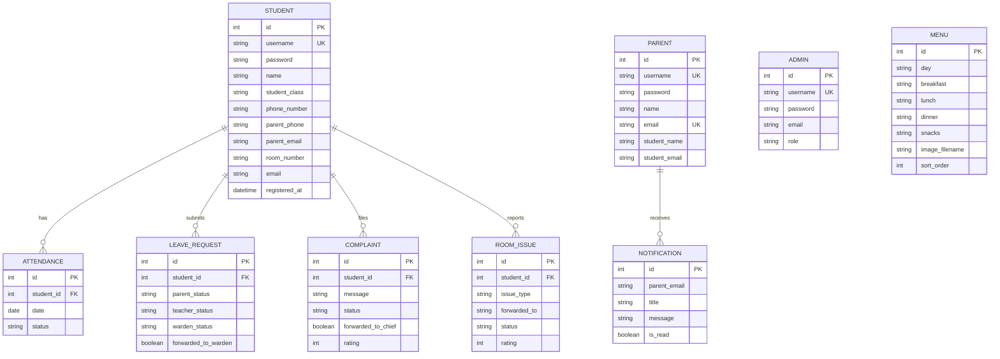

<div align="center">

# 🏛️ HostelOS Enterprise Student Residential Management Platform

### *Enterprise-Grade Hostel Operations Platform*

[](https://python.org)
[](https://flask.palletsprojects.com)
[](https://sqlite.org)
[](LICENSE)
[]()

<br/>

> **A full-stack, role-based hostel management system engineered for VIT University.**  
> Digitizes the entire hostel lifecycle — from meal scheduling and food complaints to multi-tier leave approvals, room maintenance dispatch, attendance tracking, and parent oversight — all through dedicated, access-controlled portals.

<br/>

[Getting Started](#-getting-started) · [Features](#-features) · [Architecture](#-architecture) · [Portals](#-portals) · [API Routes](#-api-routes) · [Tech Stack](#-tech-stack) · [Contributing](#-contributing)

---

</div>

<br/>

## 📸 System Overview

```
┌──────────────────────────────────────────────────────────────────┐
│                   VIT HOSTEL MANAGEMENT SYSTEM                   │
├──────────────────────────────────────────────────────────────────┤
│                                                                  │
│   ┌─────────┐  ┌─────────┐  ┌─────────┐  ┌─────────────────┐   │
│   │ Student  │  │ Parent  │  │  Admin  │  │   Authorities   │   │
│   │ Portal   │  │ Portal  │  │Dashboard│  │    Portals      │   │
│   └────┬─────┘  └────┬────┘  └────┬────┘  └───────┬─────────┘   │
│        │             │            │               │              │
│        └─────────────┴────────────┴───────────────┘              │
│                           │                                      │
│                    ┌──────┴──────┐                                │
│                    │  Flask App  │                                │
│                    │  (app.py)   │                                │
│                    └──────┬──────┘                                │
│                           │                                      │
│                    ┌──────┴──────┐                                │
│                    │  SQLAlchemy │                                │
│                    │  + SQLite   │                                │
│                    └─────────────┘                                │
│                                                                  │
└──────────────────────────────────────────────────────────────────┘
```

<br/>

## ✨ Features

### 🍽️ Food & Mess Management
| Feature | Description |
|---------|-------------|
| **Weekly Menu Timetable** | Day-wise breakfast, lunch, snacks & dinner schedule with image support |
| **Menu CRUD Operations** | Add, edit, delete, and rearrange menu items with drag-and-drop ordering |
| **Food Complaints** | Students submit complaints with photo evidence, timestamps & meal context |
| **Complaint Forwarding** | Warden can forward complaints to the Chief Cook for resolution |
| **Resolution Tracking** | Full lifecycle: `Pending → Forwarded → Solved`, with solution notes |
| **Student Ratings** | Post-resolution satisfaction ratings (1-5 stars) with comments |

### 📋 Leave Management System
| Feature | Description |
|---------|-------------|
| **Multi-Tier Approval** | 3-stage pipeline: Parent → Class Incharge → Warden |
| **Parent Gate** | Parents must approve/reject before faculty even sees the request |
| **Teacher Review** | Class Incharge reviews and forwards approved requests to Warden |
| **Warden Final Authority** | Warden provides final approval with full visibility into the chain |
| **Rejection Reasoning** | Every rejection at any tier includes a mandatory reason |
| **Date Range Support** | Leave requests include `from_date` and `to_date` fields |

### 🔧 Room Issue & Maintenance
| Feature | Description |
|---------|-------------|
| **Issue Categorization** | Carpenter Work · Electrician Work · Plumbing Work · General Maintenance |
| **Smart Dispatch** | Warden forwards issues to the correct worker based on issue type |
| **Worker Portals** | Carpenter, Electrician & Plumber each get their own dedicated portal |
| **Photo Evidence** | Students attach images to document room issues |
| **Resolution Workflow** | `Pending → Forwarded → Solved` with admin notes & solution descriptions |
| **Satisfaction Ratings** | Students rate the resolution quality after issue closure |

### 📊 Attendance & Student Management
| Feature | Description |
|---------|-------------|
| **Daily Attendance** | Mark students as Present/Absent with unique constraint per student per day |
| **CSV Export** | Download attendance records as CSV for reporting |
| **Bulk Clear** | Clear attendance records for fresh marking |
| **Student Registry** | Admin view of all registered students with management capabilities |
| **Account Deletion** | Cascading delete removes all associated data (complaints, issues, leave, attendance) |

### 👨‍👩‍👧 Parent Portal
| Feature | Description |
|---------|-------------|
| **Independent Registration** | Parents register by linking to their child's email |
| **Leave Oversight** | Review and approve/reject leave requests before they reach faculty |
| **Notification System** | Real-time notifications for leave request updates and status changes |
| **Child Monitoring** | View child's leave history, complaints, and room issues |

### 🔐 Security & Authentication
| Feature | Description |
|---------|-------------|
| **Role-Based Access Control** | 7 distinct roles: Warden, Class Incharge, Chief Cook, Dean, Carpenter, Electrician, Plumber |
| **Separate Auth Flows** | Independent login/register for Students, Parents, and Authorities |
| **Security Questions** | 2-factor account recovery via security question verification |
| **Password Reset Pipeline** | `Forgot Password → Security Questions → Reset` |
| **Session Management** | Flask session-based authentication with role validation per route |
| **Access Denied Handling** | Graceful denial with required role messaging |

<br/>

## 🏗️ Architecture

### Database Schema — 8 Core Models



### Directory Structure

```
HostelFoodSystem/
│
├── app.py                          # Main application — all routes & business logic (1800+ LOC)
├── database.py                     # SQLAlchemy models, relationships & role definitions
├── requirements.txt                # Python dependencies
│
├── instance/
│   └── hostel.db                   # SQLite database (auto-created)
│
├── static/
│   ├── css/
│   │   └── style.css               # Global stylesheet (32KB+ of custom CSS)
│   └── uploads/
│       ├── menu_images/            # Uploaded food menu images
│       ├── complaint_images/       # Food complaint photo evidence
│       ├── leave_images/           # Leave request attachments
│       └── room_issue_images/      # Room issue documentation photos
│
└── templates/                      # 37 Jinja2 HTML templates
    ├── base.html                   # Base layout template
    ├── index.html                  # Landing page — portal selection
    │
    ├── # Student Templates
    ├── student_login.html
    ├── student_register.html
    ├── student_dashboard.html      # Main student hub with all features
    ├── student_leave.html          # Leave request submission
    ├── student_room_issue.html     # Room issue reporting
    ├── student_food_complaint.html # Food complaint filing
    │
    ├── # Parent Templates
    ├── parent_login.html
    ├── parent_register.html
    ├── parent_dashboard.html       # Leave approvals & child monitoring
    │
    ├── # Authority Templates
    ├── login.html                  # Authority login
    ├── register.html               # Authority registration
    ├── admin_dashboard.html        # Central admin control panel
    ├── portal_warden.html          # Warden operations portal
    ├── portal_class_incharge.html  # Class incharge operations
    ├── portal_dean.html            # Dean oversight portal
    ├── portal_chief.html           # Chief cook — food complaint resolution
    ├── portal_worker.html          # Carpenter/Electrician/Plumber portal
    │
    ├── # Shared Feature Templates
    ├── timetable.html              # Public weekly food timetable
    ├── attendance.html             # Attendance marking & management
    ├── complaints.html             # Complaint management view
    └── ...                         # Additional utility templates
```

<br/>

## 🎭 Portals

The system provides **7 role-specific portals**, each tailored with relevant operations:

<div align="center">

| Portal | Role | Key Capabilities |
|--------|------|-------------------|
| 🛡️ **Warden** | `warden` | Menu management, leave final approval, room issue dispatch, complaints forwarding, attendance, student registry |
| 📚 **Class Incharge** | `class_incharge` | Leave request review & forwarding, student management |
| 👨‍🍳 **Chief Cook** | `chief` | Food complaint resolution, solution notes |
| 🎓 **Dean** | `dean` | Full oversight — all complaints, leave requests, room issues, attendance |
| 🔨 **Carpenter** | `carpenter` | Assigned room issues (furniture, fixtures) |
| ⚡ **Electrician** | `electrician` | Assigned room issues (electrical work) |
| 🔧 **Plumber** | `plumber` | Assigned room issues (plumbing work) |
| 🎓 **Student** | — | Leave requests, food complaints, room issues, dashboard |
| 👪 **Parent** | — | Leave approval/rejection, notifications, child monitoring |

</div>

<br/>

## 🛣️ API Routes

<details>
<summary><strong>🔓 Authentication & Registration (16 routes)</strong></summary>

| Method | Route | Description |
|--------|-------|-------------|
| `GET/POST` | `/login` | Authority login |
| `GET/POST` | `/register` | Authority registration |
| `GET/POST` | `/forgot-password` | Authority password recovery |
| `GET/POST` | `/security-questions` | Security question verification |
| `GET/POST` | `/reset-password` | Password reset |
| `GET` | `/logout` | Authority logout |
| `GET/POST` | `/student/login` | Student login |
| `GET/POST` | `/student/register` | Student registration |
| `GET/POST` | `/student/forgot-password` | Student password recovery |
| `GET/POST` | `/student/security-questions` | Student security verification |
| `GET/POST` | `/student/reset-password` | Student password reset |
| `GET/POST` | `/parent/login` | Parent login |
| `GET/POST` | `/parent/register` | Parent registration |
| `GET` | `/parent/logout` | Parent logout |

</details>

<details>
<summary><strong>📊 Dashboards & Portals (11 routes)</strong></summary>

| Method | Route | Description |
|--------|-------|-------------|
| `GET` | `/` | Landing page — portal selection |
| `GET` | `/dashboard` | Admin dashboard (role-aware redirect) |
| `GET` | `/authorities` | Authorities hub |
| `GET` | `/portal/warden` | Warden portal |
| `GET` | `/portal/class-incharge` | Class Incharge portal |
| `GET` | `/portal/chief` | Chief Cook portal |
| `GET` | `/portal/dean` | Dean portal |
| `GET` | `/portal/carpenter` | Carpenter portal |
| `GET` | `/portal/electrician` | Electrician portal |
| `GET` | `/portal/plumber` | Plumber portal |
| `GET` | `/student/dashboard` | Student dashboard |
| `GET` | `/parent/dashboard` | Parent dashboard |

</details>

<details>
<summary><strong>🍽️ Menu & Food Management (5 routes)</strong></summary>

| Method | Route | Description |
|--------|-------|-------------|
| `GET` | `/timetable` | Public weekly food timetable |
| `POST` | `/add_menu` | Add new menu item |
| `POST` | `/edit_menu/<id>` | Edit existing menu item |
| `GET` | `/delete/<id>` | Delete menu item |
| `GET/POST` | `/rearrange` | Rearrange menu display order |

</details>

<details>
<summary><strong>📋 Leave Management (7 routes)</strong></summary>

| Method | Route | Description |
|--------|-------|-------------|
| `GET/POST` | `/student/leave` | Submit leave request |
| `GET` | `/leave-requests` | View all leave requests (admin) |
| `POST` | `/leave-requests/teacher-update` | Class Incharge approve/reject |
| `POST` | `/leave-requests/forward-warden` | Forward to Warden |
| `POST` | `/leave-requests/warden-update` | Warden approve/reject |
| `POST` | `/leave-requests/update` | Generic leave status update |
| `GET` | `/leave-requests/delete/<id>` | Delete leave request |
| `POST` | `/parent/leave/update` | Parent approve/reject |

</details>

<details>
<summary><strong>🔧 Room Issues & Complaints (10 routes)</strong></summary>

| Method | Route | Description |
|--------|-------|-------------|
| `GET/POST` | `/student/room-issue` | Report room issue |
| `GET/POST` | `/student/food-complaint` | File food complaint |
| `GET` | `/complaints` | View all complaints (admin) |
| `GET` | `/room-issues` | View all room issues (admin) |
| `POST` | `/room-issues/forward` | Forward issue to worker |
| `POST` | `/room-issues/update` | Update room issue status |
| `POST` | `/complaints/forward-chief` | Forward complaint to Chief |
| `POST` | `/complaints/update` | Update complaint status |
| `POST` | `/room-issues/rate` | Student rates room issue resolution |
| `POST` | `/complaints/rate` | Student rates complaint resolution |

</details>

<details>
<summary><strong>📊 Attendance & Admin (6 routes)</strong></summary>

| Method | Route | Description |
|--------|-------|-------------|
| `GET` | `/attendance` | Attendance management page |
| `POST` | `/attendance/mark` | Mark daily attendance |
| `GET` | `/attendance/download` | Export attendance as CSV |
| `POST` | `/attendance/clear` | Clear attendance records |
| `GET/POST` | `/registered-students` | View/manage registered students |
| `GET` | `/registered-students/delete/<id>` | Delete student account |

</details>

<br/>

## 🚀 Getting Started

### Prerequisites

- **Python 3.10+** installed on your machine
- **pip** package manager

### Installation

```bash
# 1. Clone the repository
git clone https://github.com/your-username/HostelFoodSystem.git
cd HostelFoodSystem

# 2. Create a virtual environment (recommended)
python -m venv venv

# Activate — Windows
venv\Scripts\activate

# Activate — macOS / Linux
source venv/bin/activate

# 3. Install dependencies
pip install -r requirements.txt

# 4. Run the application
python app.py
```

### 🌐 Access the Application

Once running, open your browser and navigate to:

```
http://127.0.0.1:5000
```

### 🔑 Default Credentials

| Portal | Username | Password |
|--------|----------|----------|
| **Warden (Admin)** | `warden` | `1234` |

> ⚠️ **Change the default credentials immediately after first login.**

<br/>

## 🛠️ Tech Stack

<div align="center">

| Layer | Technology |
|-------|-----------|
| **Backend** | Python · Flask 3.0.3 |
| **ORM** | Flask-SQLAlchemy |
| **Database** | SQLite (file-based, zero-config) |
| **Frontend** | Jinja2 · HTML5 · CSS3 · JavaScript |
| **Icons** | Font Awesome |
| **File Uploads** | Werkzeug `secure_filename` |
| **Data Export** | Python `csv` module |
| **Session Mgmt** | Flask Sessions (server-side) |
| **DB Migrations** | Auto-migration via `migrate_db_columns()` |

</div>

<br/>

## 🔄 Auto-Migration System

The application includes a built-in migration system that automatically adds new columns to existing tables on startup — **no manual migrations required**.

```python
def migrate_db_columns():
    # Inspects existing tables and adds missing columns
    # Supports: complaint, student, admin, leave_request, room_issue
    # Zero-downtime, idempotent, runs on every startup
```

This ensures the database schema stays in sync with the codebase even after updates, without requiring tools like Alembic.

<br/>

## 📐 Design Decisions

| Decision | Rationale |
|----------|-----------|
| **Monolithic `app.py`** | Single-file simplicity for a university project — all 60+ routes in one place for easy navigation |
| **SQLite over PostgreSQL** | Zero-config, file-based, perfect for single-server deployment at a hostel |
| **Role-based portals** | Each authority sees only what they need — reduces cognitive load and prevents unauthorized operations |
| **3-tier leave approval** | Mirrors real-world hostel leave process: Parent → Teacher → Warden |
| **Built-in migration** | Eliminates Alembic complexity; schema changes are additive and auto-applied |
| **Image uploads** | Photo evidence for complaints and issues increases accountability |
| **Security questions** | Simple 2-factor recovery without requiring email infrastructure |

<br/>

## 🤝 Contributing

Contributions are welcome. Follow these steps:

1. **Fork** the repository
2. **Create** a feature branch (`git checkout -b feature/amazing-feature`)
3. **Commit** your changes (`git commit -m 'feat: add amazing feature'`)
4. **Push** to the branch (`git push origin feature/amazing-feature`)
5. **Open** a Pull Request

### Commit Convention

```
feat:     New feature
fix:      Bug fix
docs:     Documentation
style:    Formatting, no code change
refactor: Code restructuring
test:     Adding tests
chore:    Maintenance
```

<br/>

## 📄 License

This project is licensed under the **MIT License** — see the [LICENSE](LICENSE) file for details.

<br/>

---

<div align="center">

**Built with ❤️ for VIT University**

*Digitizing hostel operations, one module at a time.*

<br/>

[](https://flask.palletsprojects.com)
[](https://python.org)

</div>
